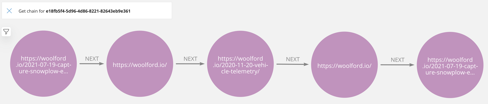

# snowplow-neo4j-journey-chains

Creates chains of relationships for each pageview.

    MATCH(p:PageView) DETACH DELETE p;

    CALL snowplow.create.journey.chains();

    MATCH (u:User {domain_userid: '47aeb6c3-ce09-48d6-a66d-d4223669dc39'})
    MATCH (u)-[:HAS_CHAIN]->(pv1)
    MATCH path = (pv1)-[:NEXT*0..]->()
    RETURN path;

Helpful Kafka functions:

    http DELETE snowplow.woolford.io:8083/connectors/snowplow-local-neo4j

    kafka-consumer-groups.sh --bootstrap-server pkc-lzvrd.us-west4.gcp.confluent.cloud:9092 --command-config config.properties --group connect-snowplow-local-neo4j --topic snowplow-enriched-good-json --reset-offsets --to-earliest --execute

    http PUT snowplow.woolford.io:8083/connectors/snowplow-local-neo4j/config <<< '
    {
        "connector.class": "streams.kafka.connect.sink.Neo4jSinkConnector",
        "key.converter": "org.apache.kafka.connect.storage.StringConverter",
        "name": "snowplow-local-neo4j",
        "neo4j.authentication.basic.password": "********",
        "neo4j.authentication.basic.username": "neoadmin",
        "neo4j.database": "snowplow",
        "neo4j.server.uri": "neo4j://neo4j.woolford.io:7687",
        "neo4j.topic.cypher.snowplow-enriched-good-json": "CALL snowplow.append.journey.chain(event.domain_userid, event.page_url, apoc.date.fromISO8601(event.derived_tstamp)) YIELD chainLength RETURN chainLength",
        "topics": "snowplow-enriched-good-json",
        "value.converter": "org.apache.kafka.connect.json.JsonConverter",
        "value.converter.schemas.enable": "false"
    }'

[//]: # (TODO: add diagram with chains)
[//]: # (TODO: add PageView node index)
